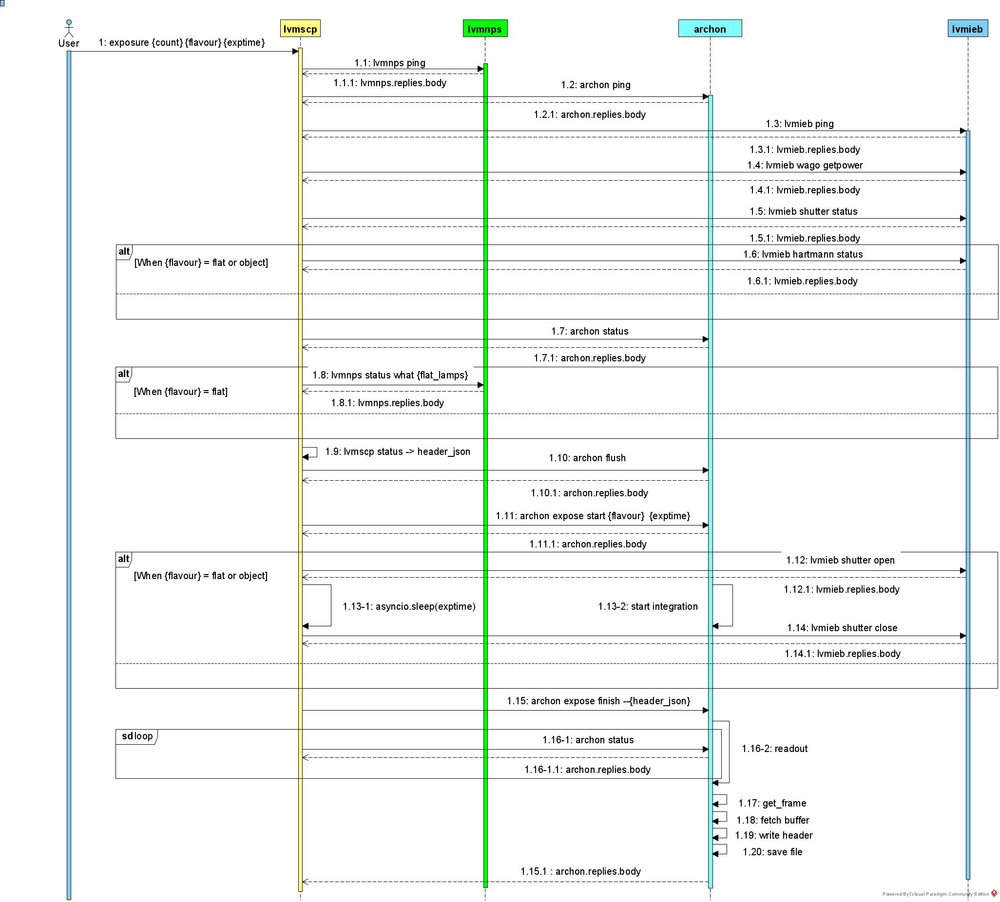

.. _Examples:

Examples
=====================

Starting the Actor
----------------------

lvmscp actor provides the control system to manage the spectrograph.
First you have to start the actor by the terminal command line in the python virtual environment that you installed the lvmscp package. ::

  $ lvmscp start

If you want to start with debugging mode, you can start like this.
In this case, you can finish the software by ctrl + c on the terminal ::

  $ lvmscp start --debug

Also you can check the status of the actor is running by this command ::

  $ lvmscp status

After your work is done, you can finish the actor by this command ::

  $ lvmscp stop

Finally, you can restart(stop -> start) the actor when the actor is running by this command ::

  $ lvmscp restart

Interface with the Actor
----------------------------------

If you started the actor by the *lvmscp start* command, you can interface with the actor by the clu CLI(Command Line Interface) ::

  $ clu

If you want to ignore the status message from other actors, you can use this command ::

  $ clu -b

Then you will enter to the clu CLI. 
You can check if the actor is running by the ping-pong commands. ::

  lvmscp ping
      07:41:22.636 lvmscp >
      07:41:22.645 lvmscp : {
          "text": "Pong."
          }

Help command
----------------------
          
First you can confirm the existing commands of *lvmscp* by the *help* command ::

    lvmscp help
    03:16:18.048 lvmscp > 
    03:16:18.061 lvmscp : {
        "help": [
            "Usage: lvmscp [OPTIONS] COMMAND [ARGS]...",
            "",
            "Options:",
            "  --help  Show this message and exit.",
            "",
            "Commands:",
            "  exposure  Exposure command controlling all lower actors",
            "  help      Shows the help.",
            "  ping      Pings the actor.",
            "  status    Receive all of the telemetry related to the spectrograph",
            "  talk      talk to lower actors for engineering",
            "  version   Reports the version."
        ]
    }

Talk command
----------------------

*These commands are all assuming that the lower actors (lvmieb, lvmnps, archon) are running.*

If you confirmed the lvmscp actor is running with the *ping* command, you can run *talk* commands to interact with lower actors such as *lvmieb*, *lvmnps*, *archon*.
For example, if you want to send the command in lower actor via *lvmscp* you can use this command ::

  lvmscp talk {lower_actor} {message}

If you want to send the command with the argument, you can send it as a string. For example, ::

  lvmscp talk lmvieb "wago getpower"

Then this will return ::

  03:12:21.334 lvmscp > 
  03:12:21.377 lvmscp : {
      "shutter_power": "ON",
      "hartmann_right_power": "ON",
      "hartmann_left_power": "ON"
  }

Or to turn on the Krypton lamp connected to the NPS(Network Power Switch), ::

  lvmscp talk lvmnps "status what Krypton"

Then this will return ::

  lvmscp talk lvmnps "status what Krypton"
  03:13:22.408 lvmscp > 
  03:13:24.033 lvmscp : {
      "STATUS": {
          "DLI-NPS-03": {
              "Krypton": {
                  "STATE": 0,
                  "DESCR": "Krypton spectral calibration Lamp",
                  "SWITCH": "DLI-NPS-03",
                  "PORT": 5
              }
          }
      }
  }

Status command
----------------------
  
If you run the status command via lvmscp, you can receive the telemetry data of the lower devices
The default spectrograph is "sp1", the spectrograph on the carnegie lab for AI&T. ::

  lvmscp status {spectrograph}

will return this kind of status data ::

  03:17:59.326 lvmscp > 
  03:18:00.465 lvmscp i {
      "IEB_POWER": {
          "shutter_power_status": "ON",
          "hartmann_left_power_status": "ON",
          "hartmann_right_power_status": "ON"
      },
      "ACTION": {
          "shutter_status": "closed",
          "hartmann_left_status": "opened",
          "hartmann_right_status": "opened"
      },
      "IEB_HUMIDITY": {
          "rhtRH1": 56.13,
          "rhtRH2": 57.89,
          "rhtRH3": 56.89
      },
      "IEB_TEMPERATURE": {
          "rhtT1": 23.1,
          "rhtT2": 22.52,
          "rhtT3": 22.86,
          "rtd1": 22.7,
          "rtd2": 24.1,
          "rtd3": 23.7,
          "rtd4": 23.8
      },
      "TRANSDUCER_TEMP": {
          "r1": 23.84,
          "b1": 22.89,
          "z1": 22.58
      },
      "TRANSDUCER_PRES": {
          "r1": 0.06273,
          "b1": 15.3,
          "z1": 0.04805
      },
      "NETWORK_POWER_SWITCHES": {
          "STATUS": {
              "DLI-NPS-01": {
                  "DLI-NPS-01.port1": {
                      "STATE": 1,
                      "DESCR": "DLI-NPS-01 Port 1",
                      "SWITCH": "DLI-NPS-01",
                      "PORT": 1
                  },
                  "-": {
                      "STATE": 0,
                      "DESCR": "DLI-NPS-01 Port 2",
                      "SWITCH": "DLI-NPS-01",
                      "PORT": 2
                  },
                  "DLI-NPS-01.port3": {
                      "STATE": 0,
                      "DESCR": "DLI-NPS-01 Port 3",
                      "SWITCH": "DLI-NPS-01",
                      "PORT": 3
                  },
                  "DLI-NPS-01.port4": {
                      "STATE": 0,
                      "DESCR": "DLI-NPS-01 Port 4",
                      "SWITCH": "DLI-NPS-01",
                      "PORT": 4
                  },
                  "DLI-NPS-01.port5": {
                      "STATE": 1,
                      "DESCR": "DLI-NPS-01 Port 5",
                      "SWITCH": "DLI-NPS-01",
                      "PORT": 5
                  },
                  "DLI-NPS-01.port6": {
                      "STATE": 1,
                      "DESCR": "DLI-NPS-01 Port 6",
                      "SWITCH": "DLI-NPS-01",
                      "PORT": 6
                  },
                  "DLI-NPS-01.port7": {
                      "STATE": 0,
                      "DESCR": "DLI-NPS-01 Port 7",
                      "SWITCH": "DLI-NPS-01",
                      "PORT": 7
                  },
                  "625 nm LED (M625L4)": {
                      "STATE": 0,
                      "DESCR": "LED",
                      "SWITCH": "DLI-NPS-01",
                      "PORT": 8
                  }
              },
              "DLI-NPS-02": {
                  "Router/Switch": {
                      "STATE": 1,
                      "DESCR": "Router power switch",
                      "SWITCH": "DLI-NPS-02",
                      "PORT": 1
                  },
                  "LN2 NIR valve": {
                      "STATE": 0,
                      "DESCR": "Cryogenic solenoid valve of NIR camera for liquid nitrogen.",
                      "SWITCH": "DLI-NPS-02",
                      "PORT": 2
                  },
                  "LVM-Archon-02": {
                      "STATE": 1,
                      "DESCR": "Archon controller",
                      "SWITCH": "DLI-NPS-02",
                      "PORT": 3
                  },
                  "IEB06": {
                      "STATE": 1,
                      "DESCR": "LVM Instrument Electronic Box",
                      "SWITCH": "DLI-NPS-02",
                      "PORT": 4
                  },
                  "LN2 Red Valve": {
                      "STATE": 0,
                      "DESCR": "Cryogenic solenoid valve of Red camera for liquid nitrogen.",
                      "SWITCH": "DLI-NPS-02",
                      "PORT": 5
                  },
                  "RPi": {
                      "STATE": 1,
                      "DESCR": "Raspberry Pi",
                      "SWITCH": "DLI-NPS-02",
                      "PORT": 6
                  },
                  "FFS LED": {
                      "STATE": 0,
                      "DESCR": "LED",
                      "SWITCH": "DLI-NPS-02",
                      "PORT": 7
                  },
                  "Pressure transducers": {
                      "STATE": 1,
                      "DESCR": "Pressure transducers",
                      "SWITCH": "DLI-NPS-02",
                      "PORT": 8
                  }
              },
              "DLI-NPS-03": {
                  "Argon": {
                      "STATE": 0,
                      "DESCR": "Hg-Ar spectral calibration Lamp",
                      "SWITCH": "DLI-NPS-03",
                      "PORT": 1
                  },
                  "Outlet 2": {
                      "STATE": 0,
                      "DESCR": "DLI-NPS-03 Port 2",
                      "SWITCH": "DLI-NPS-03",
                      "PORT": 2
                  },
                  "Outlet 3": {
                      "STATE": 0,
                      "DESCR": "DLI-NPS-03 Port 3",
                      "SWITCH": "DLI-NPS-03",
                      "PORT": 3
                  },
                  "LDLS": {
                      "STATE": 0,
                      "DESCR": "LDLS spectral calibration Lamp",
                      "SWITCH": "DLI-NPS-03",
                      "PORT": 4
                  },
                  "Krypton": {
                      "STATE": 0,
                      "DESCR": "Krypton spectral calibration Lamp",
                      "SWITCH": "DLI-NPS-03",
                      "PORT": 5
                  },
                  "Neon": {
                      "STATE": 0,
                      "DESCR": "Neon spectral calibration Lamp",
                      "SWITCH": "DLI-NPS-03",
                      "PORT": 6
                  },
                  "Outlet 7": {
                      "STATE": 0,
                      "DESCR": "DLI-NPS-03 Port 7",
                      "SWITCH": "DLI-NPS-03",
                      "PORT": 7
                  },
                  "Outlet 8": {
                      "STATE": 0,
                      "DESCR": "DLI-NPS-03 Port 8",
                      "SWITCH": "DLI-NPS-03",
                      "PORT": 8
                  }
              }
          }
      }
  }
  03:18:00.481 lvmscp : {
      "text": "done"
  }

Exposure command
----------------------

Finally, we have the exposure command.
The exposure command controls each devices(NPS, IEB, Archon controller) and runs the exposure sequence.
The exposure sequence is shown on the diagram below.

You can run the command as such syntax. ::

    lvmscp exposure {count} {image_type} {exposure_time} {spectrograph}

    
For example, ::

    lvmscp exposure 1 object 30 sp1

If you run the lvmscp command, such interface will be run::

    06:28:40.005 lvmscp > 
    06:28:40.007 lvmscp i {
        "text": "Pinging . . ."
    }
    06:28:40.010 lvmscp i {
        "text": "lvmnps OK!"
    }
    06:28:40.018 lvmscp i {
        "text": "archon OK!"
    }
    06:28:40.029 lvmscp i {
        "text": "lvmieb OK!"
    }
    06:28:40.030 lvmscp i {
        "text": "Checking device Power . . ."
    }
    06:28:40.074 lvmscp i {
        "text": "device power OK!"
    }
    06:28:40.075 lvmscp i {
        "text": "Checking Shutter Closed . . ."
    }
    06:28:40.101 lvmscp i {
        "text": "Shutter Closed!"
    }
    06:28:40.102 lvmscp i {
        "text": "Checking archon controller initialized . . ."
    }
    06:28:40.166 lvmscp i {
        "text": "archon initialized!"
    }
    06:28:40.168 lvmscp i {
        "text": "Starting the exposure."
    }
    06:28:40.169 lvmscp i {
        "text": "Taking exposure 1 of 1."
    }
    06:28:44.601 lvmscp i {
        "text": "Flushing"
    }
    06:28:46.008 lvmscp i {
        "text": "Starting exposure in controllers sp1."
    }
    06:28:46.010 lvmscp i {
        "text": "readout . . ."
    }
    06:29:37.426 lvmscp i {
        "text": "readout finished!"
    }
    06:29:37.443 lvmscp i {
        "text": "Saving HDUs."
    }
    06:29:37.445 lvmscp i {
        "text": "File sdR-s-r1-00000609.fits.gz written to disk."
    }
    06:29:37.446 lvmscp i {
        "filename": "/data/spectro/lvm/59452/sdR-s-r1-00000609.fits.gz"
    }
    06:29:37.448 lvmscp i {
        "text": "File sdR-s-b1-00000609.fits.gz written to disk."
    }
    06:29:37.449 lvmscp i {
        "filename": "/data/spectro/lvm/59452/sdR-s-b1-00000609.fits.gz"
    }
    06:29:37.451 lvmscp i {
        "text": "File sdR-s-z1-00000609.fits.gz written to disk."
    }
    06:29:37.452 lvmscp i {
        "filename": "/data/spectro/lvm/59452/sdR-s-z1-00000609.fits.gz"
    }
    06:29:37.454 lvmscp : {
        "text": "Exposure sequence done!"
    }
