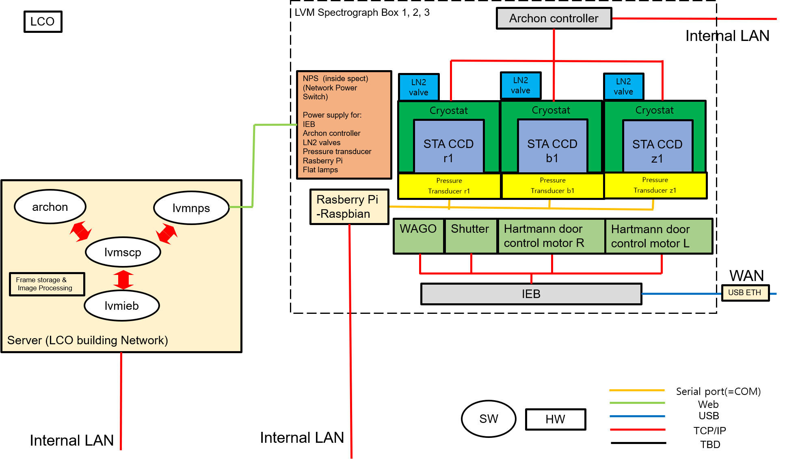
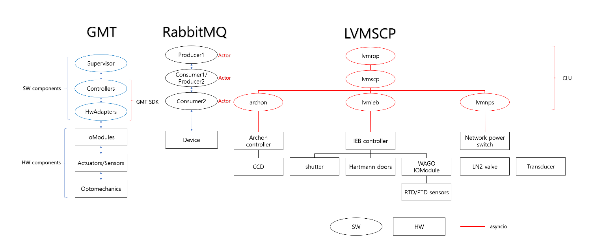

.. _getting-started:

Getting started
============================

Introduction
-------------

SCP stands for 'Spectrograph Control Package' and lvmscp is the actor that controls the lower level actors which are controlling devices inside the spectrograph. lvmscp is based on the sdss software framework CLU. Among them, ‘sdss-clu’ is applied to create an actor that controls each hardware and executes communication.

In 'CLU', We define what an *actor* is: and actor is a piece of software that performs a well defined task (control a CCD camera, interface with a database) and is a *server* that receives *commands* and replies with a series of *keywords*. If you are not familiar with those concepts, the `CLU's documentation <https://clu.readthedocs.io/en/latest/index.html>`_ is a good reference place.

Installation
-------------

.. include:: ../../README.rst
  :start-line: 2

Hardware Components
--------------------------

Here is the Hardware and Software Component diagram in spectrograph.

Architecture
--------------------------

Here is the Architecture and component diagram explaining the hierarchy of lvmscp.
lvmscp is using the AMQP Actor class from clu which is based on RabbitMQ protocol, and each actor becomes a producer/consumer to activate commands.

